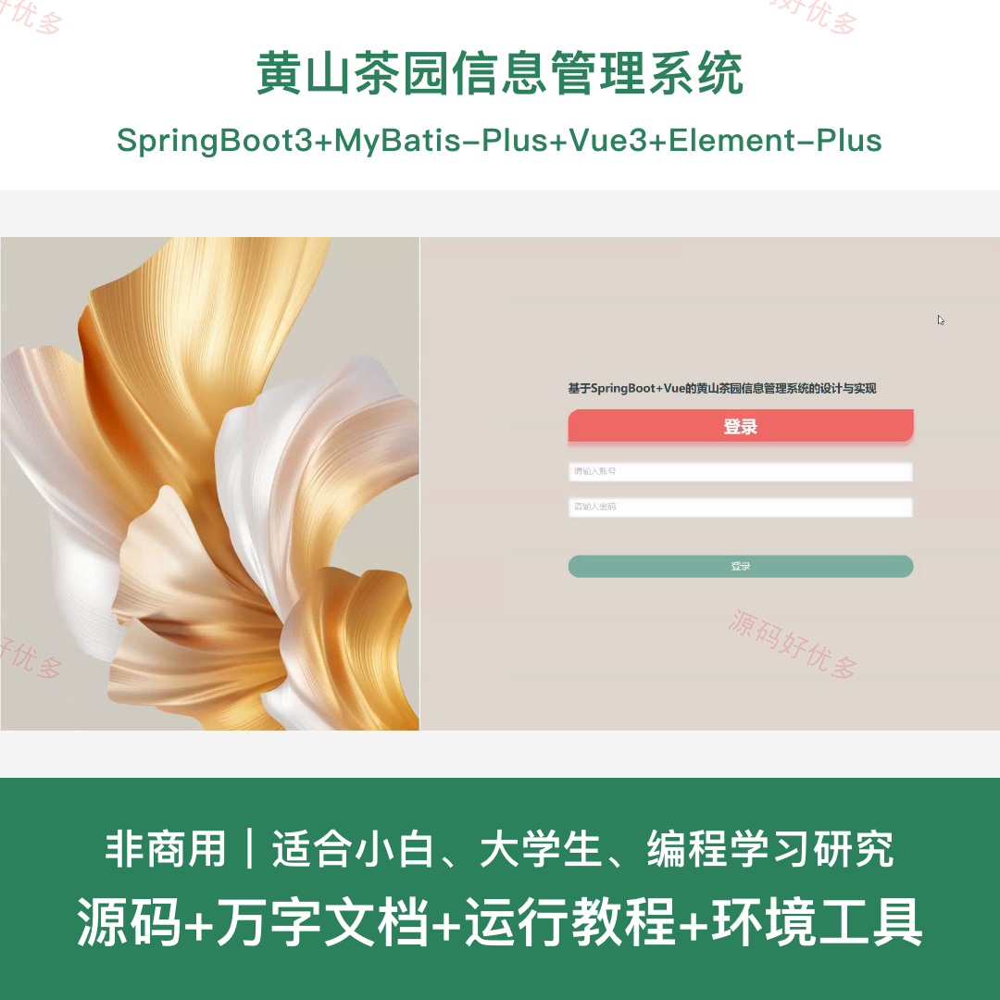
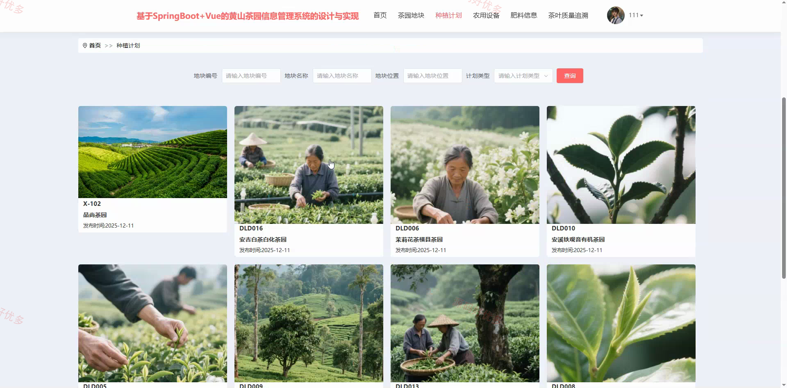
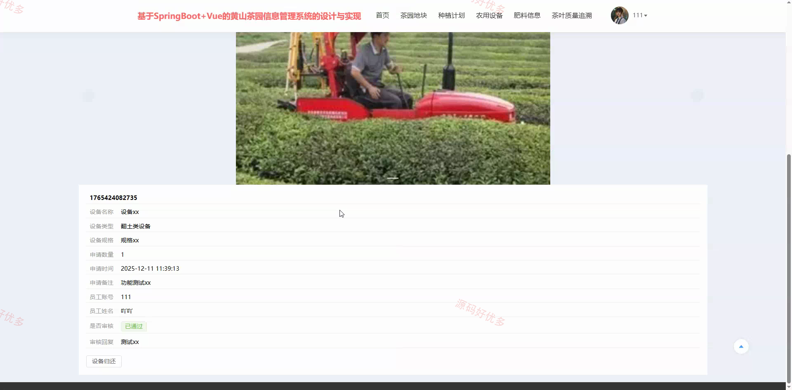
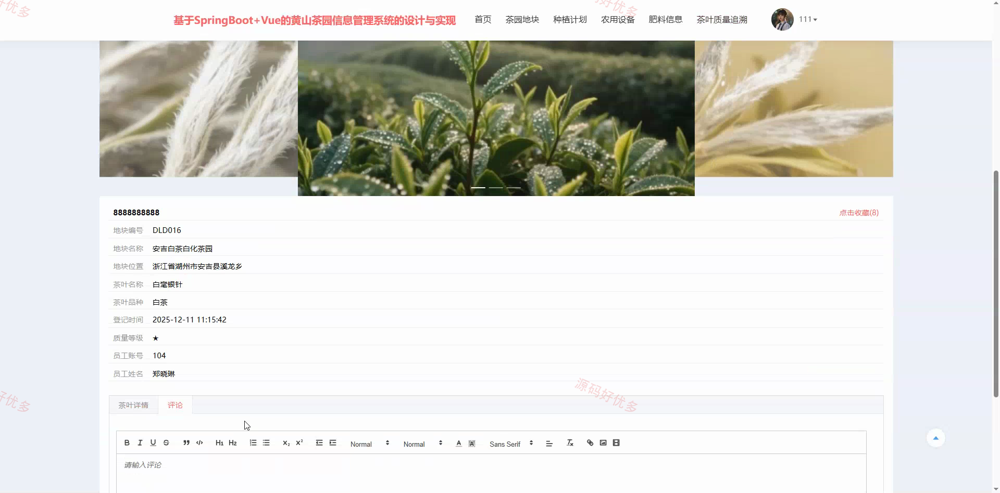
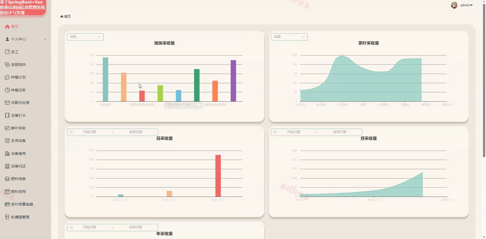
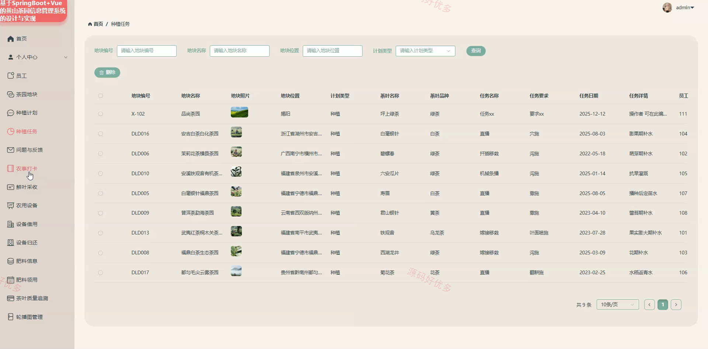
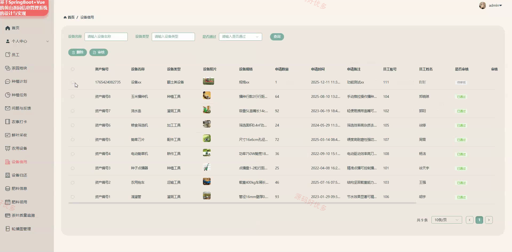
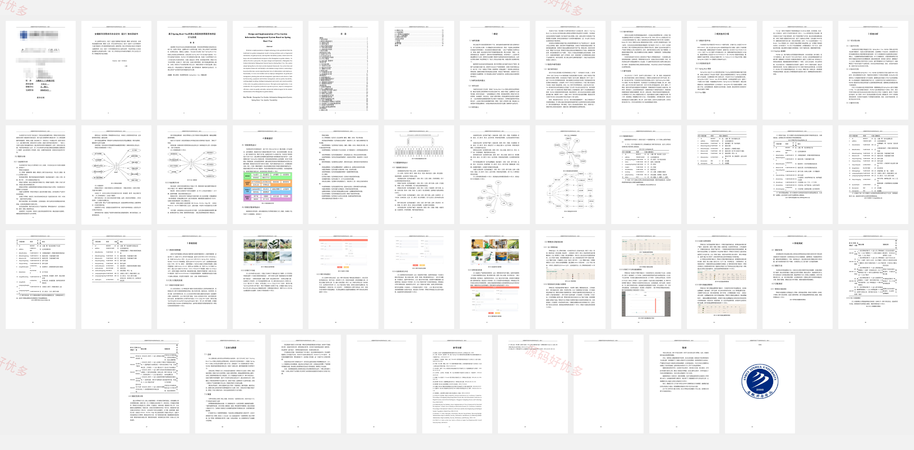

# springbootA619D
springbootA619D黄山茶园信息管理系统
## 源码问题查看主页咨询

### 一、关键词
黄山茶园、茶园地块、种植计划、鲜叶采收、茶叶质量追溯

### 二、作品包含
源码+数据库+万字设计文档+全套环境和工具资源+本地部署教程

### 三、项目技术
前端技术： Html、Css、Js、Vue3.5、Element-Plus
后端技术：Java、SpringBoot3.3.0、MyBatis-Plus

### 四、运行环境（以下版本亲测，其他版本兼容性请自行测试）
开发工具：IDEA/eclipse + VSCODE

数据库：MySQL8.0+（共19张表）

数据库管理工具：Navicat10以上版本

环境配置软件： JDK17 + Maven3.6.3

前端Nodejs：16+

浏览器：谷歌浏览器

### 五、项目介绍
项目编号：springbootA619D

黄山茶园信息管理系统面向管理员和员工，覆盖茶园地块、种植计划与任务、农事打卡、鲜叶采收、农用设备、肥料领用及茶叶质量追溯等业务，实现茶园生产过程的协同管理。

角色：管理员、员工

管理员功能：后台登录、员工管理、茶园地块与种植计划管理、种植任务与农事打卡管理、问题反馈审核、鲜叶采收统计与质量追溯、农用设备借还管理、肥料信息与领用管理。

员工功能：前台登录与个人中心、茶园地块与种植计划查看、种植任务执行、问题反馈与农事打卡、鲜叶采收与质量追溯、农用设备借用与归还、肥料查看与领用、茶园信息收藏。

### 六、运行截图

